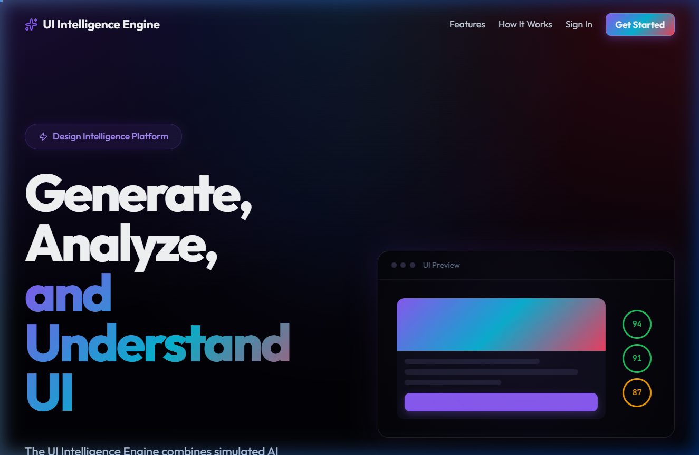
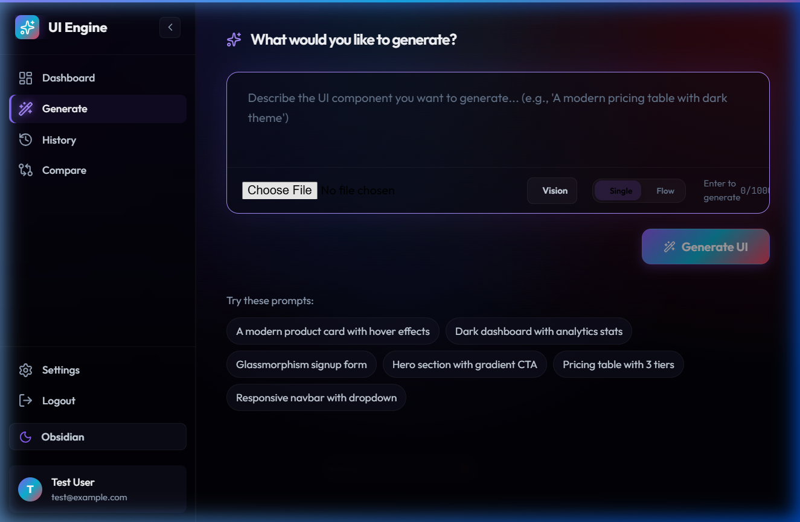
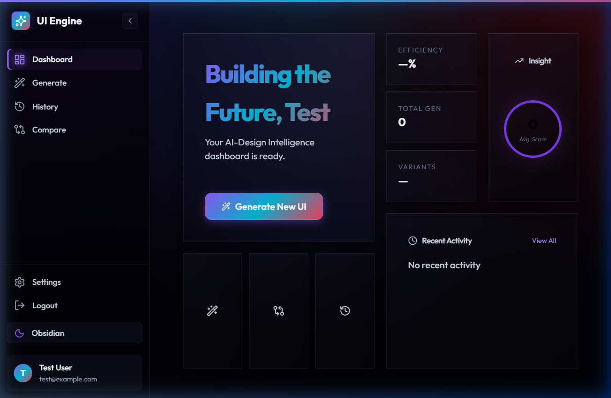
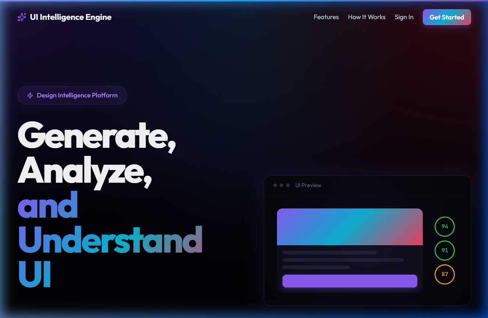
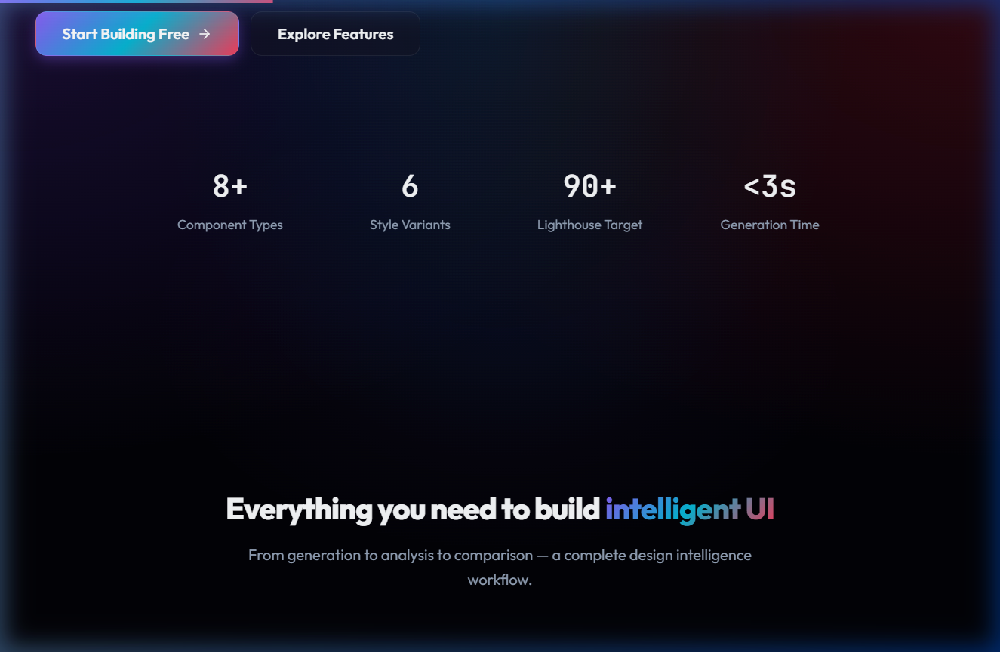

# 🌌 UI Intelligence Engine (Omniscreen 2026)

[](https://github.com/)
[](https://react.dev/)
[](https://developer.mozilla.org/en-US/docs/Web/CSS)

> **"Generate, Analyze, and Understand."** The UI Intelligence Engine is a production-grade, AI-powered design platform that bridges the gap between conceptual prompt and production-ready component.
>
> 🚀 **[Live Demo — Explore the Engine](https://ui-intelligence-engine-nu.vercel.app/)**



---

## ⚡ Core Value Proposition

The UI Intelligence Engine isn't just a generator—it's an **Analytical Design Ledger**. It combines high-fidelity AI simulation with deep engineering audits to ensure every component generated meets elite standards for Performance, Accessibility, and SEO.

### 🌟 Key Features

#### 1. Quantum Generation Workshop
Transform natural language into React-ready UI components across 8+ architectural categories (Auth, Bento, Metrics, etc.). Support for both **Single Component** and **Multi-Step Flow** modes.


#### 2. Bento-Grid Performance Analytics
Get real-time Lighthouse-equivalent scoring for every generation. The **Auditor Engine** analyzes DOM complexity, color contrast, and meta-compliance instantly.


#### 3. Design DNA & Rationale
Understand the *"Why"* behind the design. The **Explain Mode** visualizes the component tree and breaks down the design decisions made by the AI.


#### 4. Project CHRONOS (History Hub)
A semantic design ledger grouped by **Today**, **Yesterday**, and **Earlier**. Tabbed filtering (All/Components/Pages) keeps your design growth organized.

---

## 🛠 Tech Stack Icons

<p align="left">
  
  
  
  
  
  
  
</p>

---

## 🏗️ Technical Architecture

### Frontend (The Design OS)
- **Framework**: React 19 (Ultra-Performance)
- **Animation**: Framer Motion (High-Fidelity Transitions)
- **State**: Zustand (Atomic Persistent State)
- **Styling**: CSS Modules with `clamp()` heuristic fluid typography.
- **Routing**: React Router 7 (Pre-cached navigation).

### Backend (The Intelligence Layer)
- **Runtime**: Node.js / Express
- **Security**: JWT-based Authentication.
- **Data**: JSON-backed local persistence.

---

## 🎨 Design Personalities

The engine supports three distinct, high-fidelity themes:
- **Obsidian (Deep Noir)**: The standard-bearer. Premium dark mode with atmospheric 4-point gradients.
- **Paper (Clarity)**: A professional, high-contrast light mode for engineering focus.
- **Cyber HC (High Contrast)**: An accessibility-hardened neon theme for maximal legibility.

---

## 🚀 Installation & Deployment

### Prerequisites
- Node.js v18.x or higher
- NPM v9.x or higher

### 1. Repository Setup
```bash
git clone https://github.com/Raushankumar0720/UI-Intelligence-Engine.git
cd ui-intelligence-engine
```

### 2. Dependency Injection
```bash
# Professional install (Frontend & Backend)
npm run install-all
```

### 3. Environment Configuration
Create a `.env` file in the `/server` directory:
```env
PORT=5000
JWT_SECRET=your_quantum_key_here
```

### 4. Zero-Gravity Launch
```bash
# Start both Vite Dev Server & Express Backend
npm run start-all
```

---

## 🤖 Workflow Heuristics



---

### 🌐 Social & SEO
The platform is hardened with **Project LUCID SCAN**, featuring:
- **Dynamic Meta Hub**: Adaptive titles and descriptions for every page.
- **JSON-LD**: Structured data for `SoftwareApplication` indexing.
- **Open Graph**: Premium social preview cards for Slack, Twitter, and LinkedIn.

---

*© 2026 UI Intelligence Engine Industries. Built for the elite engineering age.*
